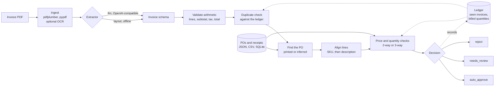

# invoice-agent

**Read invoice PDFs, match them to purchase orders and goods receipts, and get an auto-approve,
needs-review, or reject decision with the reasons spelled out.**

[](https://github.com/superintelligenceco/invoice-agent/actions/workflows/ci.yml)
[](https://github.com/superintelligenceco/invoice-agent/actions/workflows/eval.yml)
[](LICENSE)
[](pyproject.toml)
[](https://pypi.org/project/invoice-agent/)
[](https://superintelligenceco.github.io/invoice-agent/)
[](https://scorecard.dev/viewer/?uri=github.com/superintelligenceco/invoice-agent)
[](https://codespaces.new/superintelligenceco/invoice-agent?quickstart=1)

invoice-agent is an accounts-payable pipeline you can run offline. It pulls structured data out of
an invoice PDF, checks the arithmetic, finds the purchase order, aligns every invoice line with a
PO line, compares prices and quantities against what was ordered and received, and catches
duplicate submissions. Every decision comes with human-readable reasons and stable reason codes,
so a reviewer sees why an invoice stopped, and a script can route it.

It ships with a labeled dataset of 50 synthetic invoices in five vendor layouts and an `eval`
command that scores extraction and matching on it.


Read the full documentation at
[superintelligenceco.github.io/invoice-agent](https://superintelligenceco.github.io/invoice-agent/).

## Download and run

Install from PyPI:

```sh
pip install invoice-agent            # CLI, layout and LLM extractors
pip install "invoice-agent[api]"     # plus the web page and HTTP API
```

Or install the standalone executable, which needs no Python, with one command. The script picks
the release asset for your OS and CPU, checks it against `SHA256SUMS`, and installs it into
`~/.local/bin`:

```sh
curl -fsSL https://raw.githubusercontent.com/superintelligenceco/invoice-agent/main/install.sh | sh
```

Every release also ships the container image, the executables, and the wheel and sdist as
described below.

### Web app in a container

The image runs on `linux/amd64` and `linux/arm64`. It serves a web page at `/` where you upload an
invoice PDF and see the extracted fields, the line matches, and the auto-approve, needs-review, or
reject decision with its reasons. The HTTP API runs on the same port.

```sh
docker run --rm -p 8000:8000 ghcr.io/superintelligenceco/invoice-agent:latest
# open http://localhost:8000
curl -s -F "file=@dataset/invoices/016_b04.pdf" http://localhost:8000/process
```

From a clone, `docker compose up --build` builds and runs the same service.

The image loads the sample POs and receipts from the shipped dataset. To match against your own,
mount them and pass the paths:

```sh
docker run --rm -p 8000:8000 -v "$PWD/erp:/data:ro" ghcr.io/superintelligenceco/invoice-agent:latest \
  serve --host 0.0.0.0 --port 8000 --pos /data/purchase_orders.csv --receipts /data/receipts.csv
```

Tags: `vX.Y.Z` and `latest` for releases, `edge` for manual builds from `main`.

### Standalone executable

Download the single-file `invoice-agent` CLI for your platform. It bundles Python and every
dependency, including `serve`.

| Platform | Asset |
| --- | --- |
| Linux x64 | `invoice-agent-linux-x64` |
| Linux arm64 | `invoice-agent-linux-arm64` |
| macOS arm64 (Apple silicon) | `invoice-agent-macos-arm64` |
| Windows x64 | `invoice-agent-windows-x64.exe` |

```sh
curl -fLO https://github.com/superintelligenceco/invoice-agent/releases/latest/download/invoice-agent-linux-x64
curl -fLO https://github.com/superintelligenceco/invoice-agent/releases/latest/download/SHA256SUMS
sha256sum --check --ignore-missing SHA256SUMS
chmod +x invoice-agent-linux-x64
./invoice-agent-linux-x64 process invoice.pdf --pos purchase_orders.csv --receipts receipts.csv
```

### Wheel and sdist

Each release attaches `invoice_agent-X.Y.Z-py3-none-any.whl` and `invoice_agent-X.Y.Z.tar.gz`.
The same files are on [PyPI](https://pypi.org/project/invoice-agent/). To install the wheel from
the release instead, with the extras you need:

```sh
VERSION=0.2.1
pip install "invoice-agent[api] @ https://github.com/superintelligenceco/invoice-agent/releases/download/v${VERSION}/invoice_agent-${VERSION}-py3-none-any.whl"
```

## Quickstart

```sh
git clone https://github.com/superintelligenceco/invoice-agent.git && cd invoice-agent
pip install -e .
invoice-agent eval
```

`eval` runs all 50 shipped invoices through the offline pipeline and prints the tables in
[Eval results](#eval-results). No API key and no network access are needed.

## What it looks like

Process invoices in the order they arrive. The tool remembers what it has seen, so the second
invoice against the same PO counts toward what's already billed:

```console
$ invoice-agent process dataset/invoices/035_p04a.pdf dataset/invoices/036_p04b.pdf dataset/invoices/029_k07.pdf dataset/invoices/023_k01.pdf \
    --pos examples/purchase_orders.csv --receipts examples/receipts.csv
035_p04a.pdf: AUTO-APPROVE
  vendor  Pinecone Cloud Services Inc.
  invoice PCS-2026-0034
  date    2026-04-05
  total   USD 5600.00
  po      PO-2026-0130 (2-way)
  lines   1/1 matched to PO lines
036_p04b.pdf: REJECT
  vendor  Pinecone Cloud Services Inc.
  invoice PCS-2026-0035
  date    2026-04-06
  total   USD 4200.00
  po      PO-2026-0130 (2-way)
  lines   1/1 matched to PO lines
  [x] QTY_EXCEEDS_ORDERED: Line 1 ('Managed Kubernetes support', PO line 1): billed 70 (40 on earlier invoices), ordered 60.
029_k07.pdf: AUTO-APPROVE
  vendor  Kettleby Lab Consumables Ltd
  invoice KLC-INV-00877
  date    2026-03-24
  total   GBP 148.20
  po      PO-2026-0120 (3-way)
  lines   2/2 matched to PO lines
023_k01.pdf: REJECT
  vendor  Kettleby Lab Consumables Ltd
  invoice KLC-INV-00871
  date    2026-03-24
  total   GBP 148.20
  po      PO-2026-0120 (3-way)
  lines   2/2 matched to PO lines
  [x] QTY_EXCEEDS_ORDERED: Line 1 ('Nitrile examination gloves, powder-free, size M, box of 100', PO line 1): billed 20 (10 on earlier invoices), ordered 10.
  [x] QTY_EXCEEDS_ORDERED: Line 2 ('Microcentrifuge tubes 1.5 mL, natural, bag of 500', PO line 2): billed 8 (4 on earlier invoices), ordered 4.
  [!] POSSIBLE_DUPLICATE: Same vendor, currency and total (GBP 148.20) as invoice KLC-INV-00877 (029_k07.pdf), dated 2026-03-24.
```

A price above tolerance, and an invoice with no PO number where the matcher infers the PO from
the vendor's open orders:

```console
$ invoice-agent process dataset/invoices/016_b04.pdf dataset/invoices/005_q05.pdf \
    --pos dataset/purchase_orders.json --receipts dataset/receipts.json
016_b04.pdf: NEEDS REVIEW
  vendor  Brightforge Maschinenteile GmbH
  invoice BF-2026/0404
  date    2026-03-17
  total   EUR 409.05
  po      PO-2026-0114 (3-way)
  lines   2/2 matched to PO lines
  [!] PRICE_VARIANCE: Line 1 ('Zahnriemen HTD 8M / Timing belt HTD 8M', PO line 1): unit price 61.56 is 8.0% above the PO price 57.00 (tolerance 2.0% or 0.05).
005_q05.pdf: NEEDS REVIEW
  vendor  Quillfeather Office Supply Co.
  invoice QOS-10405
  date    2026-03-06
  total   USD 256.99
  po      PO-2026-0105 (3-way)
  lines   2/2 matched to PO lines
  [!] PO_MISSING: The invoice shows no PO number. PO PO-2026-0105 fits the invoice lines (score 1.00). Review the inferred PO before approving.
```

Add `--json` for one JSON result per line, and `--ledger ledger.json` to keep duplicate and
billed-quantity history across runs.

## Why it exists

Most AP automation demos stop at "extract the fields". The expensive mistakes happen after that:
paying the same invoice twice, paying for 50 units when 30 arrived, or paying a price nobody
agreed to. Those checks are simple rules, but they only work if the extracted data is exact to the
cent and the rules explain themselves.

invoice-agent keeps the two halves separate and measurable:

- Extraction is pluggable. The default extractor is deterministic and offline. An optional
  extractor calls any OpenAI-compatible endpoint for layouts the rules don't cover.
- Matching is plain Python over a strict schema. Money is `Decimal` end to end. Every finding is a
  `Reason` with a stable code, a severity, a message, and structured data.
- The eval set scores both halves, and `--oracle` scores matching on its own with ground-truth
  extraction, so you can tell an extraction regression from a rule regression.

## Pipeline



The decision is the strictest severity among the reasons: any `reject` reason rejects, any
`review` reason sends the invoice to review, and `info` reasons never block approval.

## Eval results

These are the real numbers from `invoice-agent eval` on the shipped dataset, with the offline
`layout` extractor:

### Extraction (`layout` extractor, 50 invoices)

| Field | Accuracy |
| --- | ---: |
| `vendor` | 98.0% |
| `invoice_number` | 98.0% |
| `invoice_date` | 98.0% |
| `due_date` | 98.0% |
| `po_number` | 98.0% |
| `currency` | 98.0% |
| `subtotal` | 98.0% |
| `discount` | 100.0% |
| `tax` | 98.0% |
| `total` | 98.0% |
| `line_items` | 98.0% |
| line items, per line | 99.2% |
| whole document exact | 98.0% |

### Matching and decisions (`layout` extraction, 50 invoices)

| Metric | Value |
| --- | ---: |
| Decision accuracy | 100.0% |
| PO link accuracy | 100.0% |
| Exception precision (review or reject, n=20) | 100.0% |
| Exception recall | 100.0% |
| Reject precision (n=7) | 100.0% |
| Reject recall | 100.0% |
| Reason code precision | 100.0% |
| Reason code recall | 100.0% |

Confusion matrix (rows: expected, columns: predicted):

| expected \ predicted | auto_approve | needs_review | reject |
| --- | ---: | ---: | ---: |
| auto_approve | 30 | 0 | 0 |
| needs_review | 0 | 13 | 0 |
| reject | 0 | 0 | 7 |

Cases with any difference from ground truth:

- `q10` Scanned image with no text layer: fields wrong: vendor, invoice_number, invoice_date, due_date, po_number, currency, subtotal, tax, total, line_items

Read these numbers for what they are. The layout extractor was built against these five layouts,
so the table measures regressions, not accuracy on invoices it has never seen. The one miss is the
scanned invoice, which has no text layer; the pipeline routes it to review with `NO_TEXT_LAYER`
instead of guessing. On real invoices from new vendors, expect the layout extractor to need new
label synonyms, or use the LLM extractor, and add those invoices to your own eval set.

How the metrics are defined:

- **Field accuracy** compares normalized values: vendor names without legal suffixes, document
  numbers without punctuation, dates and `Decimal` amounts exactly.
- **Exception precision and recall** treat any `needs_review` or `reject` decision as a positive.
- **Reason code precision and recall** compare the set of `review` and `reject` codes per invoice
  with the labeled set. `info` codes don't count.
- **PO link accuracy** checks the PO the matcher used, including inferred POs.

Run `invoice-agent eval --oracle` to score the matching rules with ground-truth extraction, or
`--format json` for machine-readable output. The [Eval workflow](.github/workflows/eval.yml)
posts both tables to the job summary on every push.

## Install from source

```sh
pip install -e .              # CLI, layout and LLM extractors
pip install -e ".[api]"       # plus the HTTP service (FastAPI, uvicorn)
pip install -e ".[synth]"     # plus the dataset generator (reportlab)
pip install -e ".[ocr]"       # plus OCR for scanned PDFs (needs the tesseract binary)
pip install -e ".[dev]"       # everything for development
```

Or build and run the container yourself. It serves the web page and the API with the sample POs
and receipts:

```sh
docker build -t invoice-agent .
docker run --rm -p 8000:8000 invoice-agent
```

## CLI

| Command | What it does |
| --- | --- |
| `invoice-agent extract FILE.pdf` | Print the extracted invoice as JSON. |
| `invoice-agent process FILE.pdf... --pos POS [--receipts R]` | Extract, validate, match, and decide, in order. Options: `--json`, `--ledger FILE`, `--policy FILE`. |
| `invoice-agent eval [--dataset DIR]` | Score extraction and matching. Options: `--oracle`, `--format json`, `--output FILE`, `--min-decision-accuracy 0.95`. |
| `invoice-agent generate-dataset [DIR]` | Regenerate the synthetic dataset. Output is deterministic. |
| `invoice-agent serve --pos POS [--receipts R]` | Run the web page and the HTTP API on `127.0.0.1:8000`. |

Every command that extracts takes `--extractor layout|llm` and `--ocr`.

### LLM extractor

The `llm` extractor sends the PDF text to any server that implements the OpenAI
`POST /chat/completions` API, including local servers such as vLLM, llama.cpp, or Ollama. It asks
for JSON that matches the invoice schema and validates the answer with Pydantic.

```sh
export INVOICE_AGENT_LLM_BASE_URL=http://localhost:11434/v1   # default: https://api.openai.com/v1
export INVOICE_AGENT_LLM_MODEL=qwen2.5:14b                     # default: gpt-4o-mini
export INVOICE_AGENT_LLM_API_KEY=...                           # omit for local servers
invoice-agent eval --extractor llm
```

The tests mock this endpoint, so the test suite never makes a paid API call.

## HTTP API

```sh
invoice-agent serve --pos dataset/purchase_orders.json --receipts dataset/receipts.json
curl -s -F "file=@dataset/invoices/016_b04.pdf" http://127.0.0.1:8000/process
```

| Endpoint | Body | Returns |
| --- | --- | --- |
| `GET /` | | The upload page: pick a PDF, see the fields, decision, and reasons |
| `GET /health` | | Status, version, extractor, PO count, invoices seen |
| `POST /extract` | multipart `file` (PDF, 20 MB max) | `Invoice` |
| `POST /process` | multipart `file` | `Result` with decision and reasons |
| `POST /match` | `Invoice` JSON | `Result`, for invoices extracted elsewhere |

The ledger lives in memory for the life of the process. Interactive docs are at `/docs`.

## Python API

```python
from invoice_agent.data import load_purchase_orders, load_receipts
from invoice_agent.pipeline import Pipeline

pipeline = Pipeline(load_purchase_orders("pos.csv"), load_receipts("receipts.csv"))
result = pipeline.process_pdf("invoice.pdf")
print(result.decision, [r.code for r in result.reasons])
```

See [`examples/python_api.py`](examples/python_api.py) for a loop over a folder.

## Schema

All models are Pydantic with `extra="forbid"`. Amounts are `Decimal` and serialize to JSON
strings, so `12.10` never turns into `12.1`.

| Model | Fields |
| --- | --- |
| `Invoice` | `vendor`, `invoice_number`, `invoice_date`, `due_date`, `po_number`, `currency` (ISO 4217), `line_items`, `subtotal`, `discount` (positive, default 0), `tax`, `total` |
| `LineItem` | `description`, `quantity`, `unit_price`, `amount`, `sku` (optional) |
| `PurchaseOrder` | `po_number`, `vendor`, `currency`, `lines`, `receipt_required` (true for goods and 3-way match, false for services and 2-way) |
| `POLine` | `line_no`, `description`, `quantity`, `unit_price`, `sku` (optional) |
| `GoodsReceipt` | `receipt_id`, `po_number`, `date`, `lines` of `line_no` and `quantity` |
| `Result` | `source`, `decision`, `invoice`, `po_number`, `match_type`, `vendor_score`, `line_matches`, `reasons` |
| `Reason` | `code`, `severity` (`info`, `review`, `reject`), `message`, `data` |

### PO and receipt data

`--pos` and `--receipts` accept three formats, picked by file extension:

- **JSON** (`.json`): a list of `PurchaseOrder` or `GoodsReceipt` objects. See
  [`dataset/purchase_orders.json`](dataset/purchase_orders.json).
- **CSV** (`.csv`): one row per line. POs use `po_number, vendor, currency, receipt_required,
  line_no, sku, description, quantity, unit_price`. Receipts use `receipt_id, po_number, date,
  line_no, quantity`. See [`examples/purchase_orders.csv`](examples/purchase_orders.csv).
- **SQLite** (`.db`, `.sqlite`, `.sqlite3`): tables `po_lines` and `receipt_lines` with the CSV
  columns. `invoice_agent.data.write_sqlite` creates one.

Several receipts for the same PO line add up, so partial deliveries work without extra setup.

## Matching rules

The matcher runs these steps in order:

1. **Duplicates.** Against every invoice seen so far from a vendor with a similar name, a matching
   invoice number (compared without punctuation, so `BF-2026/0401` equals `BF 2026-0401`) is
   `DUPLICATE_INVOICE`. The same currency and total within `duplicate_window_days` under a
   different number is `POSSIBLE_DUPLICATE`.
2. **Find the PO.** A printed PO number is looked up with or without its `PO` prefix. With no PO
   number, the matcher scores the vendor's open POs by how well their lines and open quantities
   fit, and uses the best one only if it's a clear winner.
3. **Vendor and currency.** The PO vendor must fuzzy-match the invoice vendor after dropping legal
   suffixes such as `Inc`, `Ltd`, and `GmbH`. A different currency is flagged, and prices aren't
   compared across currencies.
4. **Line alignment.** Equal SKUs pair first. Lines without SKUs pair by description similarity
   (token-set ratio, insensitive to case, order, and punctuation). Lines whose SKUs differ never
   pair. Each PO line pairs at most once.
5. **Price.** A unit price above the PO price by more than the larger of `price_tolerance_pct` and
   `price_tolerance_abs` needs review. A lower price is `info`.
6. **Quantity.** Billed quantity, plus what earlier non-rejected invoices already billed on that PO
   line, is compared with the ordered quantity. Over the order rejects. Otherwise, for 3-way POs,
   over the received quantity needs review.

### Reason codes

| Code | Severity | Meaning |
| --- | --- | --- |
| `NO_TEXT_LAYER` | review | The PDF has no extractable text. Enable OCR or key the invoice in by hand. |
| `EXTRACTION_INCOMPLETE` | review | A field that matching needs (vendor, number, currency, total, lines) is missing. |
| `LINE_ROUNDING` | info | A line amount differs from quantity x unit price by a rounding amount. |
| `LINE_AMOUNT_MISMATCH` | review | A line amount differs from quantity x unit price by more than rounding. |
| `SUBTOTAL_MISMATCH` | review | Line amounts do not add up to the printed subtotal. |
| `TOTAL_MISMATCH` | review | Subtotal minus discount plus tax does not equal the printed total. |
| `DUPLICATE_INVOICE` | reject | Same vendor and same invoice number as an invoice already processed. |
| `POSSIBLE_DUPLICATE` | review | Same vendor, currency and total as a recent invoice, under a different number. |
| `PO_MISSING` | review | No PO number is printed. The matcher may infer one from the vendor's open POs. |
| `PO_NOT_FOUND` | review | The printed PO number does not exist in the PO data. |
| `VENDOR_MISMATCH` | reject | The PO was issued to a different vendor. |
| `CURRENCY_MISMATCH` | review | The invoice currency differs from the PO currency. Prices are not compared. |
| `LINE_NOT_ON_PO` | review | An invoice line has no matching PO line. |
| `PRICE_VARIANCE` | review | A unit price is above the PO price by more than the tolerance. |
| `PRICE_BELOW_PO` | info | A unit price is below the PO price. |
| `QTY_EXCEEDS_ORDERED` | reject | Billed quantity, including earlier invoices, exceeds the ordered quantity. |
| `QTY_EXCEEDS_RECEIVED` | review | Billed quantity, including earlier invoices, exceeds the received quantity (3-way). |
| `PO_LINES_OPEN` | info | Some PO lines are not billed yet (partial invoicing). |

### Policy

Pass `--policy policy.json` to override any threshold. See
[`examples/policy.json`](examples/policy.json).

| Setting | Default | Meaning |
| --- | --- | --- |
| `price_tolerance_pct` | `0.02` | Allowed unit-price increase over the PO, as a fraction |
| `price_tolerance_abs` | `0.05` | Allowed unit-price increase in currency units |
| `qty_tolerance_pct` | `0` | Allowed quantity over ordered or received, as a fraction |
| `line_rounding` | `0.02` | Per-line rounding difference reported as info only |
| `total_tolerance` | `0.02` | Allowed difference on subtotal and total checks |
| `vendor_match_threshold` | `85.0` | Minimum fuzzy score (0-100) for the invoice vendor to equal the PO vendor |
| `line_match_threshold` | `0.55` | Minimum description similarity (0-1) to pair lines without a SKU |
| `duplicate_window_days` | `14` | Same vendor and total within this many days is a possible duplicate |
| `require_po_number` | `true` | Send invoices without a printed PO number to review |

## Dataset

[`dataset/`](dataset) holds 50 invoice PDFs, their ground truth, 44 purchase orders, and 36 goods
receipts. Every vendor, address, and product is fictional, and every page carries a footer that
says it is a synthetic test document. `invoice-agent generate-dataset` rebuilds it
deterministically with reportlab, and CI checks that the shipped copy matches the generator.

| Vendor layout | Style | Invoices |
| --- | --- | ---: |
| Quillfeather Office Supply Co. | US letterhead, `$1,234.56`, `MM/DD/YYYY`, no SKU column | 12 |
| Brightforge Maschinenteile GmbH | German and English labels, `1.234,56`, `DD.MM.YYYY`, position and SKU columns | 10 |
| Kettleby Lab Consumables Ltd | UK tax invoice, `£`, `14 Mar 2026`, unit column, descriptions that wrap | 9 |
| Pinecone Cloud Services Inc. | Services billed by the hour, 2-way match, `USD 1,234.56`, loyalty discounts | 9 |
| Harborline Fleet Parts LLC | Monospaced ERP printout, uppercase, up to 45 lines, several invoices span two pages | 10 |

The messy cases, each labeled with the expected decision, PO, and reason codes:

| Case | Expected |
| --- | --- |
| Exact duplicate, and a duplicate with the invoice number reformatted | reject, `DUPLICATE_INVOICE` |
| Resubmission under a new invoice number | reject, `POSSIBLE_DUPLICATE` and `QTY_EXCEEDS_ORDERED` |
| Quantity over the PO, including a second invoice that overruns it | reject, `QTY_EXCEEDS_ORDERED` |
| PO issued to another vendor | reject, `VENDOR_MISMATCH` |
| Billed more than received, or before any receipt | review, `QTY_EXCEEDS_RECEIVED` |
| Unit price 8% and 15% over the PO | review, `PRICE_VARIANCE` |
| No PO number printed (3 invoices, PO inferred) | review, `PO_MISSING` |
| PO number that doesn't exist | review, `PO_NOT_FOUND` |
| Billed in USD against a EUR PO | review, `CURRENCY_MISMATCH` |
| Surcharge line that isn't on the PO | review, `LINE_NOT_ON_PO` |
| Printed total 10.00 off, printed subtotal 25.00 off | review, `TOTAL_MISMATCH`, `SUBTOTAL_MISMATCH` |
| Scanned image with no text layer | review, `NO_TEXT_LAYER` |
| One-cent rounding on a line, price 1% over (inside tolerance), price under the PO | auto-approve |
| Partial receipts across two deliveries, short-received lines billed as received | auto-approve |

Files are numbered in submission order. Order matters, because duplicate and overbilling checks
depend on history. Each `ground_truth/*.json` holds the printed invoice values (errors included)
and the expected outcome.

## Roadmap

- Word-position extraction (pdfplumber `words`) for column-aware tables, instead of text lines.
- Bundled OCR path in the container, and scanned invoices in the eval set scored with OCR on.
- More layouts in the dataset: credit notes, multi-currency totals, tax per line, and invoices
  with several POs.
- A persistent ledger in SQLite for the HTTP service.
- Connectors that read POs and receipts from common ERP exports.
- Per-vendor policy overrides.

## Contributing

Contributions are welcome. Read [CONTRIBUTING.md](CONTRIBUTING.md) for setup, checks, and how to
add a matching rule or an invoice layout. This project follows the
[Contributor Covenant](CODE_OF_CONDUCT.md). To report a vulnerability, see
[SECURITY.md](SECURITY.md).

## License

[Apache-2.0](LICENSE)
