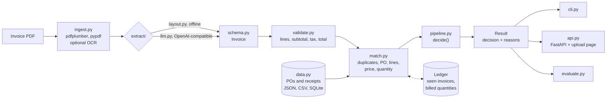

# Architecture

invoice-agent is a pipeline of small modules with one strict schema between them.

| Module | Responsibility |
| --- | --- |
| `ingest.py` | Read the text layer of each page; fall back to pypdf; OCR when asked. |
| `extract/` | Turn document text into an `Invoice`: `layout.py` (rules) or `llm.py`. |
| `normalize.py` | Parse amounts, dates, currencies, vendor names, and document numbers. |
| `validate.py` | Check line amounts, subtotal, discount, tax, and total. |
| `match.py` | Duplicates, PO lookup and inference, line alignment, price and quantity checks, the ledger. |
| `pipeline.py` | Run the steps in order and turn reasons into a decision. |
| `reasons.py` | The catalog of reason codes and their severities. |
| `policy.py` | The tunable thresholds. |
| `data.py` | Load POs and receipts from JSON, CSV, and SQLite. |
| `evaluate.py` | Field accuracy, decision metrics, and the confusion matrix. |
| `synth/` | The deterministic generator of the 50-invoice dataset. |
| `cli.py`, `api.py` | The command line and the HTTP service. |

## Distribution

Every `v*` tag runs the Ship workflow. It builds the wheel and sdist, PyInstaller executables
for four platforms, and a multi-arch image; it smoke-tests each one on a real invoice, signs the
image with cosign, attests build provenance, attaches SPDX SBOMs, publishes the package to PyPI,
and creates the GitHub Release. See [ADR 0004](adr/0004-tag-driven-release.md).
